# ASL2Text

## Introduction/Background

Speech impairment is a common disability which affects a person's ability to communicate using speech and hearing. People affected by this usually have to use other methods of communication such as sign language or hand writing / typing. Although having been used for a long time, sign language remains unfamiliar to normal people, which becomes a barrier for disability people to communicate with others in daily life normally.

Although there are larger projects underway[[1]](#ref1), we begin with a much smaller scope in mind. Within the scope of computer vision, this project's goal is to translate photos with hand signs into alphabets in the American Sign Language (ASL) standard. The results will bring us one step closer to helping people with speech impairment in having a normal conversation with non-signers.

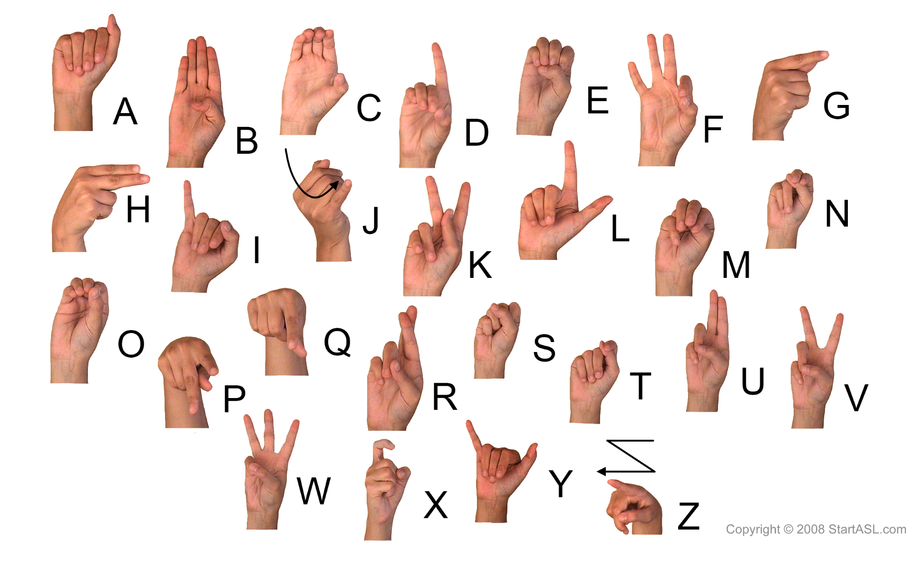

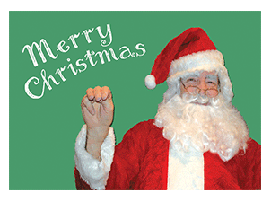  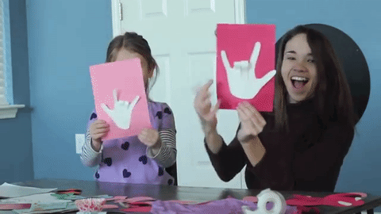

## Problem definition

Given an image of an ASL character we would like to develop a model that classifies what character the image contains. Using the model we can write an algorithm to take a video and convert into text.

In this context, the model should also ideally run quickly. Therefore we will be taking the speed/accuracy tradeoff into great account. If possible, we may aim for near real-time decoding.

## Data collection

### Issue with Kaggle dataset

[Link to Kaggle dataset](https://www.kaggle.com/grassknoted/asl-alphabet)

Repetitive: The data is mostly repetitive, which does not significantly improve testing accuracy.

Variation: The data does not have much variation in background.

Image size: The hand sign is not clear and does not have enough details for training.

### Our approach

Since there are many issues with the Kaggle data, we do not think the dataset is good enough for our purpose. As a result, we decided to collect our own data using our smartphone. 

### Initial approach

Previously, we decided to have the hand in various locations and distance away from the camera. However, this variation makes it difficult to perform image augmentation. Moreover, some features are too small compared to the image making it difficult to train the model. 

### Final approach

For each class, we decided to take a 3 minutes video (1080 x 1920 @ 30fps) of the ASL characters centered and as large as possible in the video in various lighting conditions. For every 5 frames in the video, we use OpenCV to crop out the 1080 x 1080 square of the features and then resize it to 224 x 224 pixels. As a result, we have 1000 RGB images for each ASL character of size 224 x 224 pixels. The test dataset is created using the same method, but we only use 30 images per class for the test dataset.

#### Sample images of each class

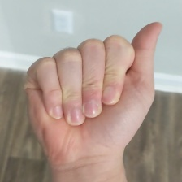 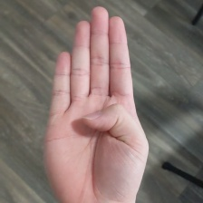
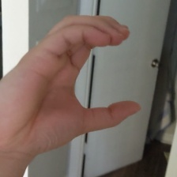
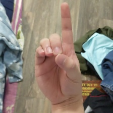
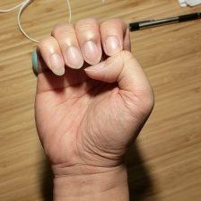
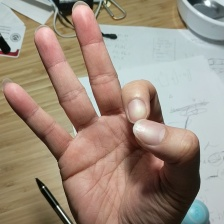
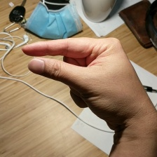
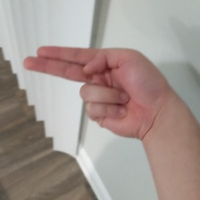
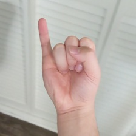
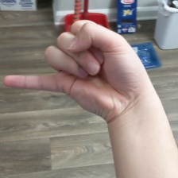
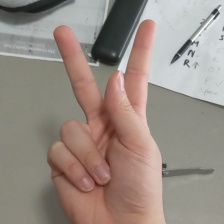
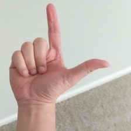
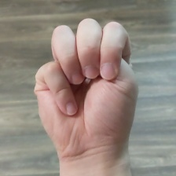
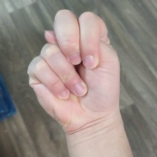
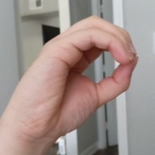
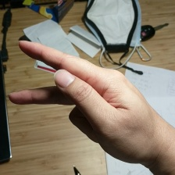
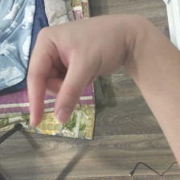
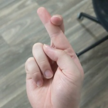
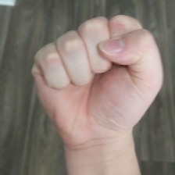
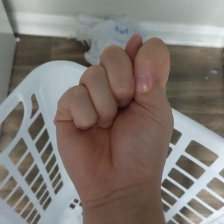
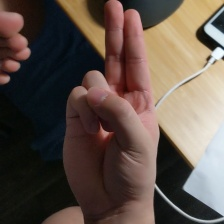
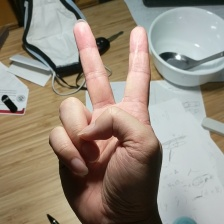
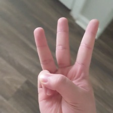
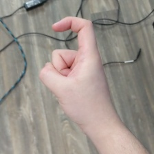
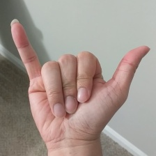
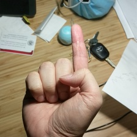
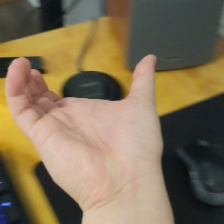
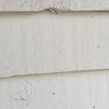
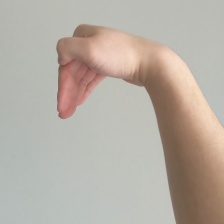

## Methods

### Image preprocessing and augmentation

For image preprocessing, we did the standard rescale by dividing all the input by 255, so that all the inputs are between 0 and 1. We also found that the original image size of 224 x 224 is too big for our model, so we resize the image to 64 x 64. We choose this because the features are still clearly visible for humans to recognize while keeping the input size as small as possible to prevent overfitting. We then split 20% of our data for validation and use the 80% for training.

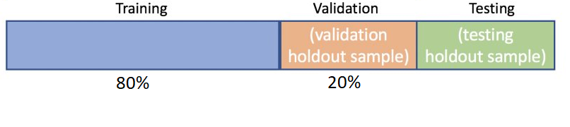

Due to our method of data collection, the hand signs lacked variation in terms of the position relative in the image. Since all the data are the same format, we can easily solve this issue using some augmentation techniques built-in with the Keras’s `ImageDataGenerator` class. The purpose of doing it this way is that we can control how much augmentation instead of remaking the dataset each time. In this case, we are interested in randomly shifting the image horizontally, shifting the image vertically, and zooming the image out. We also augmented our images with some rotation and brightness level to further diversify the images while still highlighting the important features.  

#### Samples of actual input to model

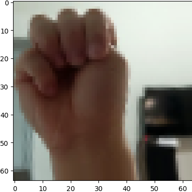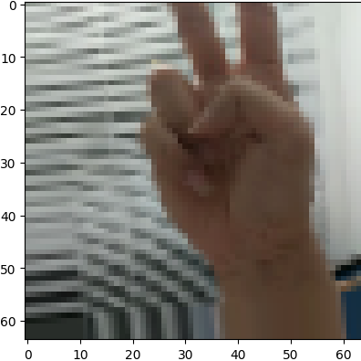
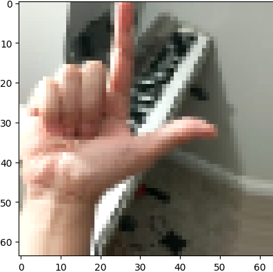
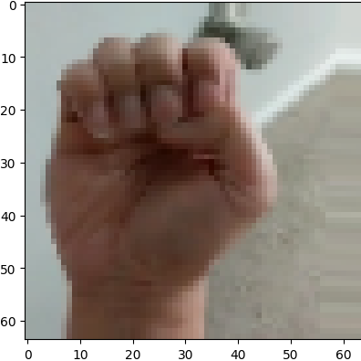
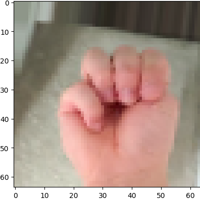
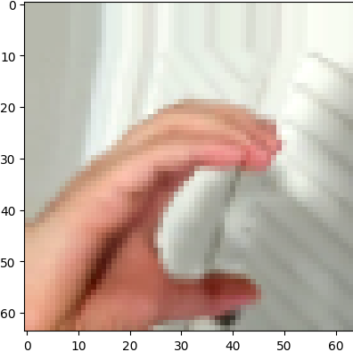
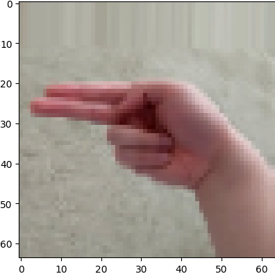
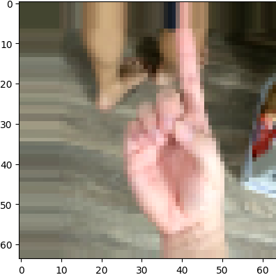

### Model

We created the model using convolution layers, max-pooling layers, and a fully connected layer with 29 nodes for each class.
For convolution layers, we use Rectified Linear Unit (ReLU) as our activation function and He uniform to initialize the weights to prevent vanishing gradient problems when we use too many layers.
The output of the final convolution layer is flattened to form 8192 features and passed to a final dense layer.
The fully connected layer uses a softmax activation function to obtain the probability for each input image to belong to each class.  
_Refer to `CNN.py` for complete model code_

#### Model Architecture

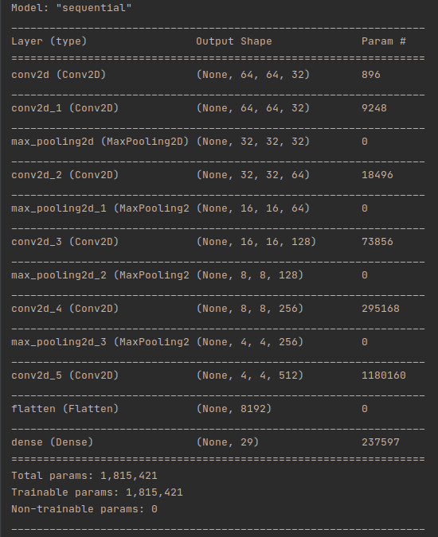

### Training process

We use Adam as our optimizer with a learning rate of 0.001. After each epoch, we run the model with our validation data to get the loss and accuracy of the current model. We choose the model with the lowest validation loss for testing. The selected models will be tested using the test dataset for accuracy. The model that we will use is the one with the highest test accuracy.

## Potential results

Even though this is still an area of active research[[2]](#ref2), the potential result is to be able to quickly translate ASL to written alphabets from images with high accuracy. Additionally, we can use the model to translate texts from live video inputs, and at best in real-time as well.

In the worst case scenario, the model may only perform well on the training set and will be unable to generalize to more real-world use cases. We have several ways to avoid that as mentioned in the [Discussion](#Discussion) section.

## Results

[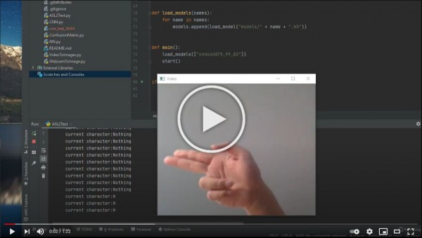](https://www.youtube.com/embed/bWLtKU8L6qM)

### Accuracy of model:

| Dataset | Accuracy |
| :---: | :---: |
| Train | 99.89% |
| Validation | 99.64% |
| Test | 93.91% |

### Recall and precision on test data:

| label | Recall | Precision |
| :---: | :---: | :---: |
| A | 96.67% | 93.55% |
| B | 93.33% | 100.00% |
| C | 100.00% | 100.00% |
| D | 100.00% | 100.00% |
| Del | 100.00% | 61.22% |
| E | 66.67% | 71.43% |
| F | 80.00% | 100.00% |
| G | 100.00% | 90.91% |
| H | 100.00% | 100.00% |
| I | 100.00% | 100.00% |
| J | 83.33% | 96.15% |
| K | 93.33% | 100.00% |
| L | 100.00% | 100.00% |
| M | 96.67% | 82.86% |
| N | 100.00% | 96.77% |
| Nothing | 93.33% | 80.00% |
| O | 100.00% | 100.00% |
| P | 40.00% | 100.00% |
| Q | 96.67% | 100.00% |
| R | 100.00% | 93.75% |
| S | 93.33% | 96.55% |
| Space | 100.00% | 100.00% |
| T | 100.00% | 96.77% |
| U | 93.33% | 100.00% |
| V | 100.00% | 93.75% |
| W | 100.00% | 100.00% |
| X | 100.00% | 100.00% |
| Y | 96.67% | 100.00% |
| Z | 100.00% | 100.00% |
| Average | 93.91% | 94.96% |

### Train confusion matrix

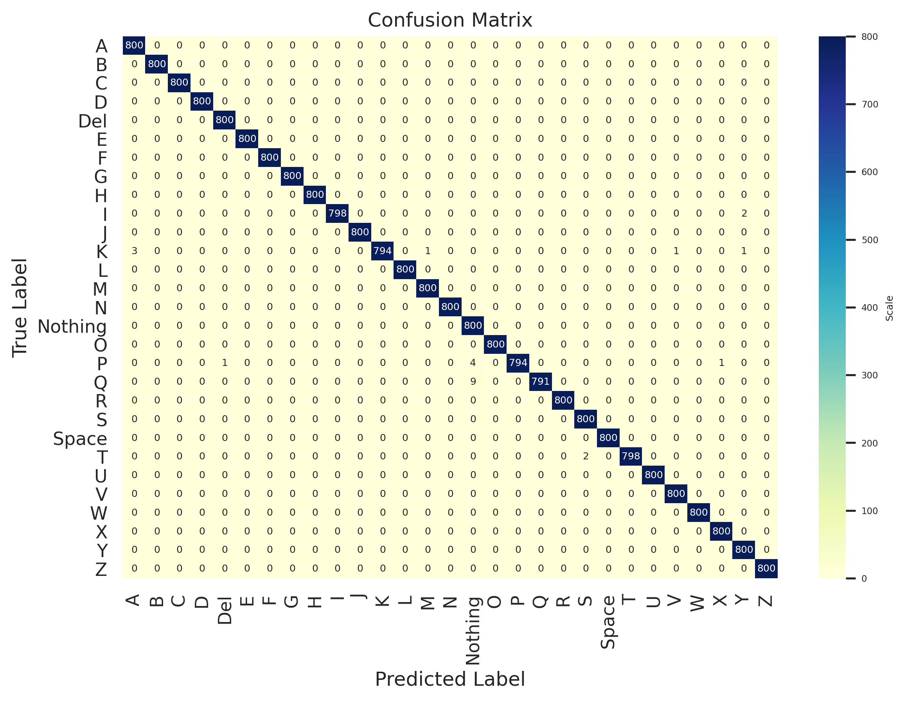

### Validation confusion matrix

### Test confusion matrix

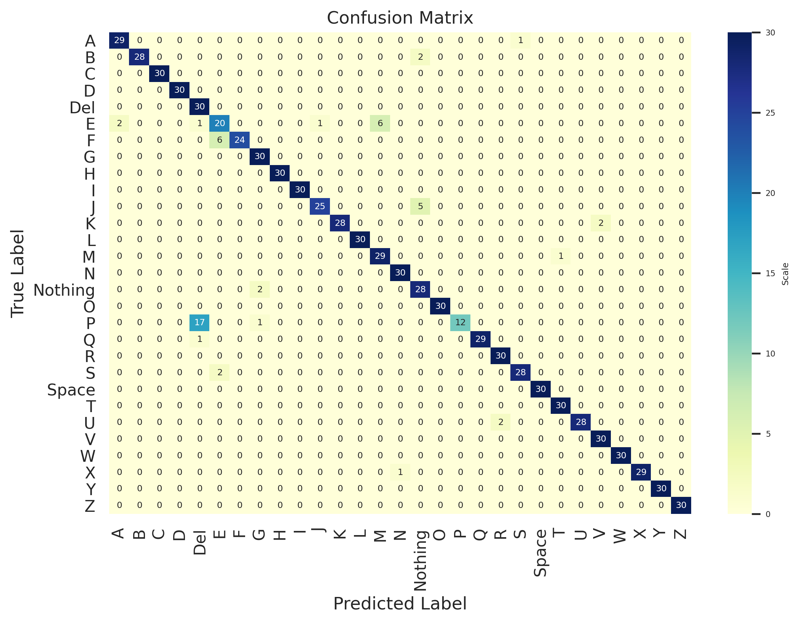

## Discussion

Looking at the dataset, we see that the images provided are very similar. For that reason, we think that this may cause the model to not perform well when tested on real data. This is evident in some of the public Kaggle notebooks where models fail to get high accuracy on testing data, and still get high validation. We will consider replacing some of the data with some of our own.

We may also like the model to perform on images and video feeds of various formats. For that, using a CNN may allow such a possibility to be more trivial.

## Conclusion

In this project, we developed a supervised machine learning model that classifies images with ASL to their corresponding character. During the process of creating our model, there are several things that we learned:

- This is a case of “garbage in, garbage out”, so collecting good data is very important to increase models performance.
- Using image augmentation prevents models from over-fitting and increases model performance.
- Using ReLU as activation function and he-uniform distribution to initial parameters prevent the vanishing gradient problem when training a deep, complex model.
- Convolution Neural Network achieves higher accuracy while using less parameters when compared to a similar Fully-connected Neural Network.

We also presented a working model that achieved 93.91% accuracy on testing dataset. Given the result, the model can potentially be used as an ASL translator. We hope that this project will inspire other projects that use machine learning in video communication.

## References

 [1] [AI Can Interpret and Translate American Sign Language Sentences](https://news.developer.nvidia.com/ai-can-interpret-and-translate-american-sign-language-sentences/)  
 [2] [P. Trigueiros, F. Ribeiro and L. P. Reis, "A comparison of machine learning algorithms applied to hand gesture recognition," *7th Iberian Conference on Information Systems and Technologies (CISTI 2012)*, Madrid, Spain, 2012, pp. 1-6.](https://ieeexplore.ieee.org/abstract/document/6263058)  
 [3] [J. Nagi *et al.*, "Max-pooling convolutional neural networks for vision-based hand gesture recognition," *2011 IEEE International Conference on Signal and Image Processing Applications (ICSIPA)*, Kuala Lumpur, Malaysia, 2011, pp. 342-347, doi: 10.1109/ICSIPA.2011.6144164.](https://ieeexplore.ieee.org/abstract/document/6144164)
